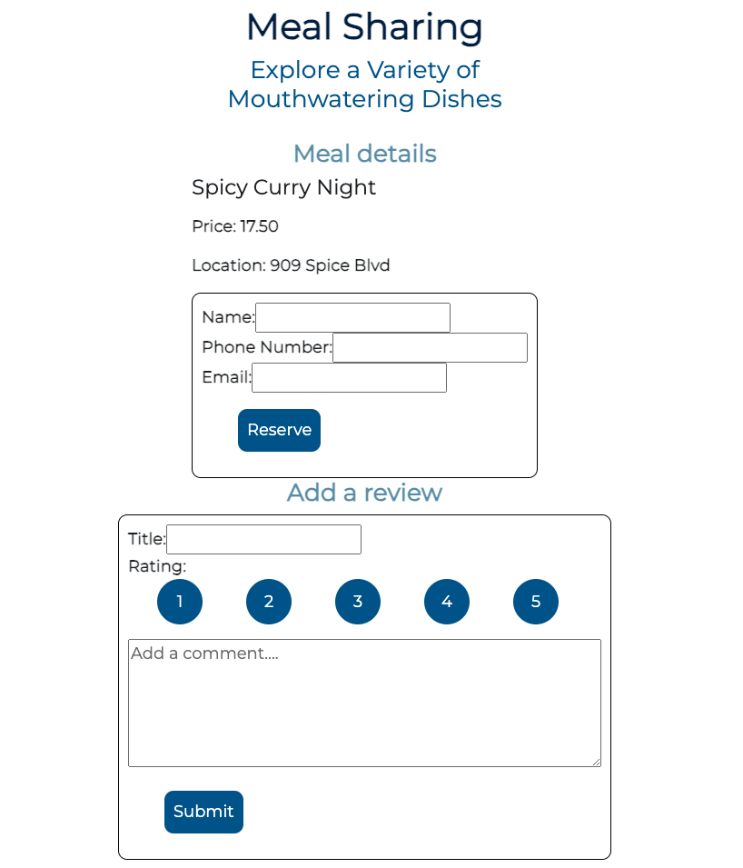

# Meal Sharing Project

Link to deployed website: [https://meal-sharing-project.onrender.com](https://meal-sharing-project.onrender.com)

Welcome to Meal Sharing Project, a dynamic full-stack web application built with cutting-edge technologies including ReactJs, Express.js, CSS and PostgreSQL.

## Description

This is the individual project in the Hack Your Future CPH course.

### features

- View all meals
- View all reviews
- Add reviews for meals
- Add new meal
- Add new reservation
- Add new user

## Built with

- [Postgres](https://www.npmjs.com/package/postgres) - Database
- [Express](https://expressjs.com/) - Server Framework
- [NodeJs](https://nodejs.org/en/) - Server Environment
- [React](https://reactjs.org/) - Frontend
- [React-Bootstrap](https://react-bootstrap.github.io/) - Frontend
- [CSS](https://developer.mozilla.org/en-US/docs/Web/CSS) - Frontend

## Screenshots

## Video

